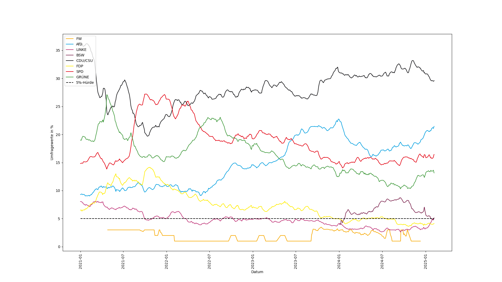

# Public polls for Germany's federal elections

This project is a rudimentary web scraper of [wahlrecht.de](https://wahlrecht.de/umfragen), a website where you can find an overview of public polls for Germany's federal election.

To run the webscraper, do `./gradlew run` (you need Java 17) and if everything works, it will put the data in [`results.json`](./results.json).

Additionally, a very rudimentary Python-script for visualising the data can be found in [`visualize.py`](./visualize.py).
Do `python visualize.py` (you need `matplotlib`); it will read `results.json` and save an image to `results.png`.

